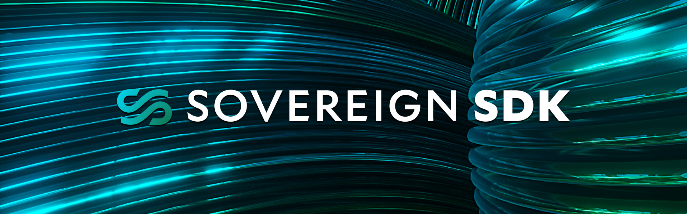

  
  

## What is the Sovereign SDK?

The Sovereign SDK is a flexible toolkit for building rollups. It provides real time (sub 10ms) soft-confirmations and excellent performance (thousands of TPS) while giving developers
full control over their application logic.

Key features include...
- Gasless transactions (via the Paymaster module)
- Integrated bridging via Hyperlane
- Wallet integrations (including Phantom, Privy, Metamask, and many more)
- Complete customizability (including transaction delays, hooks, and custom address types)
- Out-of-the-box observability (via InfluxDB and Grafana)

Note that the Sovereign SDK is provided under a revenue share agreement for commercial applications. See the LICENSE file for more details.

## Getting Started

The fastest way to get up and running is to follow the [starter guide](https://docs.sovereign.xyz/2-running-starter.html) at <docs.sovereign.xyz>. You can also find a customizable rollup
template in the [Rollup Starter](https://github.com/Sovereign-Labs/rollup-starter) repository. 

## What's Inside?

The core tooling for the SDK lives in the `crates` directory. Inside, you'll find the following: 

### Module System

The `module-system` crate defines interfaces that make it easy to re-use business logic across different rollups (located in `sov-modules-api`). It also provides a large collection
of pre-build modules for common functionality. Some examples include...
 - The `bank` module for creating and transferring tokens
 - The `paymaster` module for sponsoring transactions
 - The `hyperlane` modules, which support efficient bridging to and from Sovereign SDK rollups.

### Full Node

The `full-node` folder provides components for the full-node - including the database, APIs, the soft-confirming sequencer, and the full node itself.

The full node is responsible for downloading transactions from the DA layer and executing them to produce the rollup state. State is stored in an authenticated key-value 
store - either a Jellyfish Merkle Tree (JMT), or a [Nearly Optimal Merkle Tree](https://sovereign.mirror.xyz/jfx_cJ_15saejG9ZuQWjnGnG-NfahbazQH98i1J3NN8).

The sequencer is responsible for accepting new transactions, providing instant soft-confirmations, and then placing bundles of confirmed transactions  onto the DA layer for
full nodes to execute. 

### Adapters

The Sovereign SDK is configurable to run on top of almost any Data Availability layer or zkVM. The `adapters` folder contain the logic integrating 3rd party codebases
into the Sovereign SDK. 

Currently, we maintain zkVM adapters for:
- [`Risc0`](https://www.risczero.com)
- [`SP1`](https://succinct.xyz)

And DA layer adapters for:
- [`Celestia`](https://www.celestia.org)
- [`Bitcoin`](https://bitcoin.org/en/)

## License

See the [LICENSE](LICENSE.md) file for license rights and limitations. 
